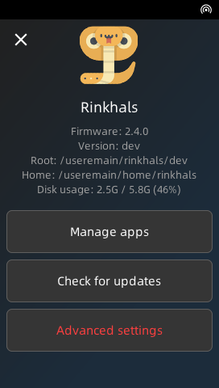
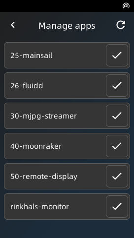
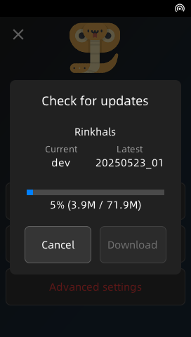

   [![GitHub Sponsors](https://img.shields.io/badge/Sponsor-indianred?logo=data%3Aimage%2Fsvg%2Bxml%3Bbase64%2CPD94bWwgdmVyc2lvbj0iMS4wIiBlbmNvZGluZz0idXRmLTgiPz4KCjwhRE9DVFlQRSBzdmcgUFVCTElDICItLy9XM0MvL0RURCBTVkcgMS4xLy9FTiIgImh0dHA6Ly93d3cudzMub3JnL0dyYXBoaWNzL1NWRy8xLjEvRFREL3N2ZzExLmR0ZCI%2BCgo8IS0tIExpY2Vuc2U6IFBELiBNYWRlIGJ5IHp1cmI6IGh0dHBzOi8vZ2l0aHViLmNvbS96dXJiL2ZvdW5kYXRpb24taWNvbi1mb250cyAtLT4KPHN2ZyBmaWxsPSIjZmZmZmZmIiB2ZXJzaW9uPSIxLjEiIGlkPSJMYXllcl8xIiB4bWxucz0iaHR0cDovL3d3dy53My5vcmcvMjAwMC9zdmciIHhtbG5zOnhsaW5rPSJodHRwOi8vd3d3LnczLm9yZy8xOTk5L3hsaW5rIiAKCSB3aWR0aD0iODAwcHgiIGhlaWdodD0iODAwcHgiIHZpZXdCb3g9IjAgMCAxMDAgMTAwIiBlbmFibGUtYmFja2dyb3VuZD0ibmV3IDAgMCAxMDAgMTAwIiB4bWw6c3BhY2U9InByZXNlcnZlIj4KPHBhdGggZD0iTTY3LjYwNywxMy40NjJjLTcuMDA5LDAtMTMuNDMzLDMuMjM4LTE3LjYwNyw4LjY3NGMtNC4xNzQtNS40MzctMTAuNTk4LTguNjc0LTE3LjYxLTguNjc0CgljLTEyLjI2NiwwLTIyLjI4MywxMC4wMTMtMjIuMzMsMjIuMzJjLTAuMDQ2LDEzLjI0NSw2LjM1OSwyMS4wNTQsMTEuNTA3LDI3LjMzMWwxLjEwNCwxLjM0OQoJYzYuMDk1LDcuNTE1LDI0Ljk5MiwyMS4wMTMsMjUuNzkyLDIxLjU4NGMwLjQ1OCwwLjMyOCwxLDAuNDkyLDEuNTM4LDAuNDkyYzAuNTM5LDAsMS4wOC0wLjE2NSwxLjUzOS0wLjQ5MgoJYzAuOC0wLjU3MSwxOS42OTctMTQuMDY5LDI1Ljc5Mi0yMS41ODRsMS4xMDMtMS4zNDljNS4xNDctNi4yNzcsMTEuNTUzLTE0LjA4NiwxMS41MDctMjcuMzMxCglDODkuODk0LDIzLjQ3NSw3OS44NzYsMTMuNDYyLDY3LjYwNywxMy40NjJ6Ii8%2BCjwvc3ZnPg%3D%3D&logoColor=white)](https://github.com/sponsors/jbatonnet) [![Ko-fi](https://img.shields.io/badge/Ko--fi-indianred?logo=data%3Aimage%2Fsvg%2Bxml%3Bbase64%2CPD94bWwgdmVyc2lvbj0iMS4wIiBlbmNvZGluZz0idXRmLTgiPz4KCjwhRE9DVFlQRSBzdmcgUFVCTElDICItLy9XM0MvL0RURCBTVkcgMS4xLy9FTiIgImh0dHA6Ly93d3cudzMub3JnL0dyYXBoaWNzL1NWRy8xLjEvRFREL3N2ZzExLmR0ZCI%2BCgo8IS0tIExpY2Vuc2U6IFBELiBNYWRlIGJ5IHp1cmI6IGh0dHBzOi8vZ2l0aHViLmNvbS96dXJiL2ZvdW5kYXRpb24taWNvbi1mb250cyAtLT4KPHN2ZyBmaWxsPSIjZmZmZmZmIiB2ZXJzaW9uPSIxLjEiIGlkPSJMYXllcl8xIiB4bWxucz0iaHR0cDovL3d3dy53My5vcmcvMjAwMC9zdmciIHhtbG5zOnhsaW5rPSJodHRwOi8vd3d3LnczLm9yZy8xOTk5L3hsaW5rIiAKCSB3aWR0aD0iODAwcHgiIGhlaWdodD0iODAwcHgiIHZpZXdCb3g9IjAgMCAxMDAgMTAwIiBlbmFibGUtYmFja2dyb3VuZD0ibmV3IDAgMCAxMDAgMTAwIiB4bWw6c3BhY2U9InByZXNlcnZlIj4KPHBhdGggZD0iTTY3LjYwNywxMy40NjJjLTcuMDA5LDAtMTMuNDMzLDMuMjM4LTE3LjYwNyw4LjY3NGMtNC4xNzQtNS40MzctMTAuNTk4LTguNjc0LTE3LjYxLTguNjc0CgljLTEyLjI2NiwwLTIyLjI4MywxMC4wMTMtMjIuMzMsMjIuMzJjLTAuMDQ2LDEzLjI0NSw2LjM1OSwyMS4wNTQsMTEuNTA3LDI3LjMzMWwxLjEwNCwxLjM0OQoJYzYuMDk1LDcuNTE1LDI0Ljk5MiwyMS4wMTMsMjUuNzkyLDIxLjU4NGMwLjQ1OCwwLjMyOCwxLDAuNDkyLDEuNTM4LDAuNDkyYzAuNTM5LDAsMS4wOC0wLjE2NSwxLjUzOS0wLjQ5MgoJYzAuOC0wLjU3MSwxOS42OTctMTQuMDY5LDI1Ljc5Mi0yMS41ODRsMS4xMDMtMS4zNDljNS4xNDctNi4yNzcsMTEuNTUzLTE0LjA4NiwxMS41MDctMjcuMzMxCglDODkuODk0LDIzLjQ3NSw3OS44NzYsMTMuNDYyLDY3LjYwNywxMy40NjJ6Ii8%2BCjwvc3ZnPg%3D%3D&logoColor=white)](https://ko-fi.com/jbatonnet) 

# Rinkhals

Rinkhals is a custom firmware for some Anycubic Kobra 3D printers (specifically the ones running Kobra OS, see below for the details).

The goal of this project is to expand existing Anycubic features with better compatibility, apps and more.
I will likely not support all use cases, like running vanilla Klipper or your specific feature / plugin.

By using Rinkhals, you will keep all stock Anycubic features (print screen, Anycubic tools, calibration, ...) and get even more, like:
- Mainsail, Fluidd (with Moonraker)
- USB camera support in Mainsail, Fluidd
- Prints from Orca will show the print screen
- SSH access for customization (user: **root**, password: **rockchip**)
- OTA Rinkhals updates
- [Apps system](https://github.com/jbatonnet/Rinkhals.apps) (OctoEverywhere, Cloudflare, Tailscale, ...)

Latest version will likely support the two latest firmwares from Anycubic, unless specified. For older firmware please check older releases.
Here are the suported printers and firmwares with latest Rinkhals release:
| Model  | Tested firmwares | Notes |
| -- | -- | -- |
| Kobra 3 (+ combo) | `2.4.4.7` `2.4.5` |
| Kobra 2 Pro | `3.1.2.3` `3.1.4` | Only with mainboard [Trigorilla Spe **B** v1.0.x](https://1coderookie.github.io/Kobra2ProInsights/hardware/mainboard/#trigorilla_spe_b_v10x-stock-new-revision). `3.1.4` seems to be buggy for some people |
| Kobra S1 (+ combo) | `2.5.8.8` `2.5.9.9` `2.6.0.0` |
| Kobra 3 Max (+ combo) | `2.5.1.3` `2.5.1.7` |
| Kobra 3 V2 (+ combo) | `1.1.0.1` `1.1.0.4` |
| Kobra S1 Max (+ combo) | `2.1.6` |

In case you're wondering this project is named after rinkhals, a sub-species of Cobras ... Kobra ... Rinkhals 👏

You can join the Rinkhals community on Discord: https://discord.gg/3mrANjpNJC

Since people have been asking, I accept donations but please remember that I work on Rinkhals for fun and not for the money. I will not accept donations to work on specific bugs or features. Donation link is the Sponsor button at the top of the page.

    

## Rinkhals installation

> [!WARNING]
> **Make sure you're confident tweaking your printer and you understand what you're doing. I'm not responsible if you brick your printer (even if there's some [documentation](https://jbatonnet.github.io/Rinkhals/Kobra%20Printers/recover-boot-issues/) about that)**

> [!CAUTION]
> Many users want to change their Klipper printer configuration (the printer.cfg file). I strongly advise not modifying the stock printer configuration. Rinkhals offers additional protection you don't have while modifying directly your printer configuration. **I won't offer any support** and **your printer might not work properly or not boot anymore**. Check the documentation for more information: [Printer configuration](https://jbatonnet.github.io/Rinkhals/Rinkhals/printer-configuration/)

A [quick start guide](https://jbatonnet.github.io/Rinkhals/guides/rinkhals-quick-start/) is available to get Rinkhals up and running on your printer.

There are two options to install Rinkhals:
1. Use the provided Rinkhals installer (named **install-*.swu**)
2. Install the raw swu directly (named **update-*.swu**)

Either way, you'll need to:
- Download the release / file you want from the [Releases](https://github.com/jbatonnet/Rinkhals/releases) page
- Rename the downlaoded SWU file as **update.swu**
- Copy it in a directory named **aGVscF9zb3Nf** (or **update** for the Kobra 2 Pro in certain conditions) on a FAT32 USB drive (MBR, GPT is not supported)
- Plug the USB drive in your printer

More detailed information about the Rinkhals installer are available in the [documentation](https://jbatonnet.github.io/Rinkhals/Rinkhals/rinkhals-installer/)

For more information about installation, firmware updates and details about specific situations, go to https://jbatonnet.github.io/Rinkhals/Rinkhals/installation-and-firmware-updates/

    

## Touch UI

After installation, Rinkhals provides a touch UI accessible from the printer screen when you tap the Settings icon, then tap Rinkhals.

This UI allows you to manage installed apps, trigger an OTA update, reboot your printer and much more. This will allow you to customize your experience and keep the printer memory as low as needed based on your needs.

    <!--  -->
    
    
    
    
    <!--  -->

## Rinkhals Installer

From the release pages, you'll find the installer-\*.swu files for your printer model. This is an interactive touch tool to install and update Rinkhals and system firmware updates.

You can find more information in [the documentation](https://jbatonnet.github.io/Rinkhals/Rinkhals/rinkhals-installer/)

## Apps system

> [!WARNING]
> Those printers are quite weak in terms of CPU and Memory. Every additional app / feature and client you connect to the web interface will make the experience slower and might end up in crashes. 
> Having said that, running your printer with Moonraker, 1\~2 apps and 1\~2 connected clients should work fine.

An apps system is provided in Rinkhals. It allows for the users to easily add some features to their printer. Some default ones are provided and other are available on separate repos like:
- https://github.com/jbatonnet/Rinkhals.apps (Tailscale, Cloudflare, OctoApp companion, some progress on vanilla Klipper, ...)
- https://github.com/basvd/Rinkhals.WebUI (a web interface for Rinkhals)

Instructions on how to install or develop apps are on the other repo as well.

    

## Contributing

> [!NOTE]
> If you develop on Windows like me, don't forget to disable Git's autocrlf function, as this repo contains Linux scripts running on Linux machines. 
> Run `git config core.autocrlf false` **BEFORE** cloning the repo

More and more contributors help this project move faster. Thank you everyone!
If you want to help Rinkhals and contribute, whether it's code, documentation or sharing good ideas, come join us on Discord!

  

Special thanks to those people for providing the base research and helping support for more printers:
- **utkabobr** (https://github.com/utkabobr/DuckPro-Kobra3)
- **systemik** (https://github.com/systemik/Kobra3-Firmware)
- **moosbewohner** for Kobra 2 Pro support (https://github.com/moosbewohner/Rinkhals)
- **Kalenell** and **woswai1337** for Kobra S1 support
- **evil_santa**, **CalmFrog**, **basvd**, **_René**, **RadioRadio** and more for Kobra 3 Max support
- Anycubic for the cool printer and the few OSS items (https://github.com/ANYCUBIC-3D/Kobra)
