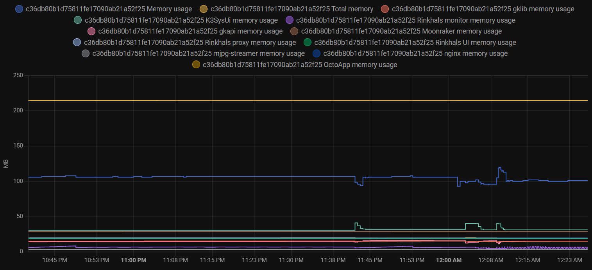
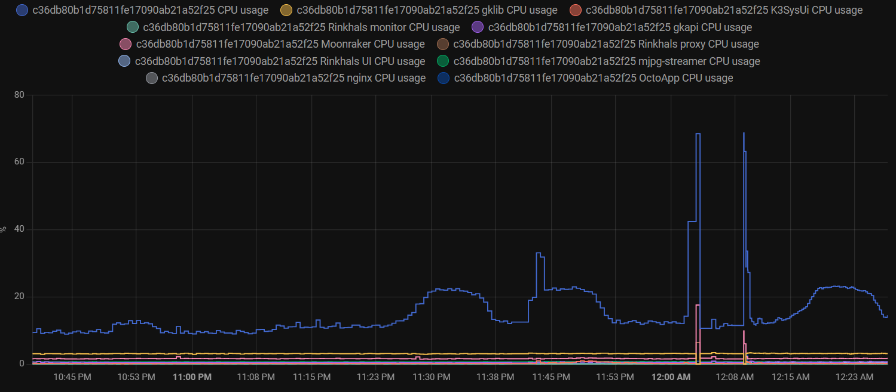

Versions of Rinkhals after commit [971d8a5](https://github.com/jbatonnet/Rinkhals/commit/971d8a552a0e31a02281d8585401128b399fa7b7) include an apps system and the Rinkhals monitor tool.

This tool allows to collect system metrics and expose them in a MQTT server. The data is preformatted to be discovered and used with Home Assistant but might be used by anything reading MQTT messages.

By default when enabled, this tool will send metrics to the internal printer Mochi server. This server is available on port 2883 and you will need credentials to connect to it. Username and password can be found in `/userdata/app/gk/config/device_account.json`

If you're not already using Home Assistant MQTT integration, you might be able to connect directly to the printer. If this is not possible, you can setup a bridge to replicate data from `homeassistant/#` and `rinkhals/#` topics to your existing Home Assistant MQTT server.
Mosquitto can be setup as a replication broker.

Here is an example Node-RED script to perform this replication:

``` json
[{"id":"59dd4e7eefe8b054","type":"mqtt in","z":"a6514c1133ecdc8a","name":"Kobra S1","topic":"#","qos":"2","datatype":"buffer","broker":"f93780ad0f3c6c32","nl":false,"rap":true,"rh":0,"inputs":0,"x":120,"y":640,"wires":[["082cc4ced39e9cc4"]]},{"id":"6370b15cf029e9f8","type":"mqtt out","z":"a6514c1133ecdc8a","name":"Home Assistant","topic":"","qos":"","retain":"","respTopic":"","contentType":"","userProps":"","correl":"","expiry":"","broker":"b5f6a01430cedf53","x":440,"y":640,"wires":[]},{"id":"082cc4ced39e9cc4","type":"switch","z":"a6514c1133ecdc8a","name":"Topic","property":"topic","propertyType":"msg","rules":[{"t":"cont","v":"homeassistant/","vt":"str"},{"t":"cont","v":"rinkhals/","vt":"str"},{"t":"else"}],"checkall":"false","repair":false,"outputs":3,"x":270,"y":640,"wires":[["6370b15cf029e9f8"],["6370b15cf029e9f8"],[]]},{"id":"f93780ad0f3c6c32","type":"mqtt-broker","name":"Kobra S1","broker":"192.168.1.167","port":"9883","tls":"f715935469ff79b9","clientid":"","autoConnect":true,"usetls":true,"protocolVersion":"5","keepalive":"60","cleansession":true,"autoUnsubscribe":true,"birthTopic":"","birthQos":"0","birthRetain":"false","birthPayload":"","birthMsg":{},"closeTopic":"","closeQos":"0","closeRetain":"false","closePayload":"","closeMsg":{},"willTopic":"","willQos":"0","willRetain":"false","willPayload":"","willMsg":{},"userProps":"","sessionExpiry":""},{"id":"b5f6a01430cedf53","type":"mqtt-broker","name":"MQTT","broker":"mqtt","port":"1883","clientid":"","autoConnect":true,"usetls":false,"protocolVersion":"3","keepalive":"60","cleansession":true,"autoUnsubscribe":true,"birthTopic":"","birthQos":"0","birthPayload":"","birthMsg":{},"closeTopic":"","closeQos":"0","closePayload":"","closeMsg":{},"willTopic":"","willQos":"0","willPayload":"","willMsg":{},"userProps":"","sessionExpiry":""},{"id":"f715935469ff79b9","type":"tls-config","name":"","cert":"","key":"","ca":"","certname":"","keyname":"","caname":"","servername":"","verifyservercert":false,"alpnprotocol":""}]
```

You can also configure the Rinkhals monitor to output the metrics to any MQTT server you want.
Create a `.env` file with the following environment variables:

```
MQTT_IP=x.x.x.x
MQTT_PORT=1883
DEVICE_ID=[NAME_OF_DEVICE_IN_HOME_ASSISTANT]

# In case your MQTT Server requires authentication add and uncomment below lines.
# MQTT_USER=my-user
# MQTT_PASSWORD=super-secret-password
```

You'll end up with this kind of graph:


