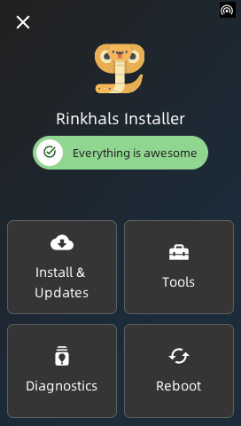
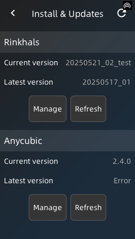
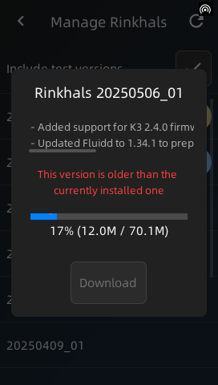
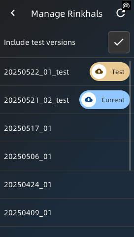
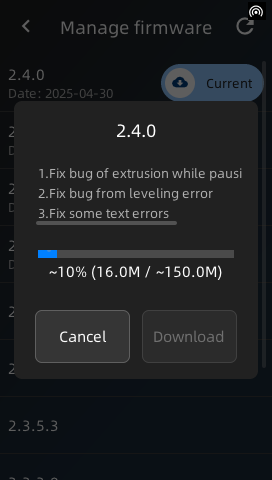
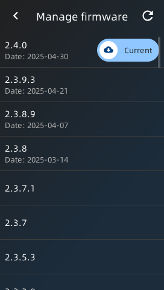
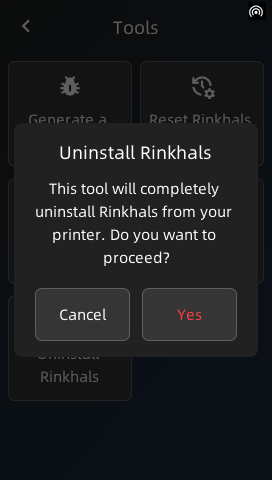
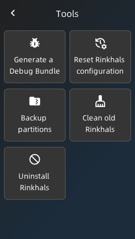
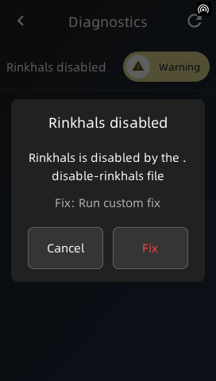
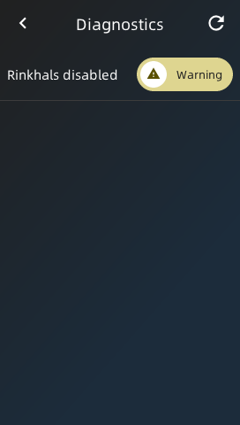

Starting from release 20250514_01, Rinkhals is released as a standard SWU update file and an Installer tool.

The installer allows you to:

- Quickly install / update / uninstall Rinkhals versions
- Update your printer firmware
- Perform some operations using tools (debug bundle, reset configuration, backups, ...)
- Collect some diagnostics in case something seems wrong and provide known fixes

<figure markdown="span">
  { width="160" }<figcaption>Installer main screen</figcaption>
</figure>

## Download and use the Rinkhals Installer

From the GitHub [Releases](https://github.com/jbatonnet/Rinkhals/releases) page, find the version you want and download the installer.swu matching your printer model.
As detailed in the [installation](./installation-and-firmware-updates.md) page, copy the .swu file as update.swu on a FAT32 USB drive. Then plug into the printer.

The installer takes about 10s to start. Once started, a SSH server will be listening on port 2222.

The main screen will show you some diagnostics results. You can tap on those to display more details and to apply the appropriate fix.

## Install & Updates

{ width="160", align=left }

From this view you'll be able to quickly see what Rinkhals and system version are installed right now on your printer and see the last available versions from GitHub and [https://rinkhals.thedju.net](https://rinkhals.thedju.net)

### Manage Rinkhals versions

!!! note

    Test Rinkhals versions will be announced on the Discord server to collect users feedback.

{ width="160", align=right }
{ width="160", align=right }

This screen shows installed and GitHub available versions of Rinkhals. You can choose wether to display test version from GitHub as well.

Tapping on one version will allow you to install, update or uninstall depending on your selection.

The version will be downloaded, extracted and then installed on your printer. The printer will then reboot to your new Rinkhals installation.

### Manage system versions

!!! warning

    A couple of things to keep in mind:

    - Downgrading firmware is not recommended as other printer components could be incompatible with the version you want to downgrade to.
    - When upgrading, if your installed Rinkhals version is not compatible with the new version it will not work properly

{ width="160", align=right }
{ width="160", align=right }

This screen shows the installed system firmware and all available firmware versions from a mirror server: [https://rinkhals.thedju.net](https://rinkhals.thedju.net)

The installer will also check directly with Anycubic servers if a new version not yet mirrored is available.

Tapping on one version will allow you to upgrade or downgrade depending on your selection.

The version will be downloaded, extracted and then installed on your printer. The printer will then reboot to your new Firmware installation.
During the installation process, the installation will be patched in order for Rinkhals to survive the OTA process.

## Tools

{ width="160", align=right }
{ width="160", align=right }

- **Generate a Debug Bundle**: Generate a ZIP of useful logs / states of your printer on the USB drive
- **Reset Rinkhals configuration**: Create a backup of your configuration on the USB drive and resets printer, moonraker and other configurations to default
- **Backup partitions**: Create a backup of /userdata and /useremain partitions (excluding gcodes, Rinkhals and other less important things) on the USB drive
- **Clean old Rinkhals**: Remove older Rinkhals versions, keeping only the last 3 version including the currently running one
- **Uninstall Rinkhals**: Completely remove Rinkhals files and configuration and revert back to stock firmware
  

## Diagnostics

{ width="160", align=right }
{ width="160", align=right }

This view will list some diagnostics the installer performs to detect potential issues with your printer.

Tapping on them will show more details and the appropriate fix to apply.

The list of diagnostics is increasing over time, here are a couple of examples:

- Rinkhals being disabled
- Modified printer configuration
- Missing startup files
