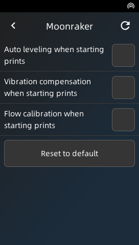
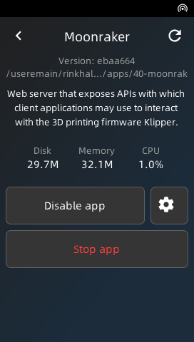
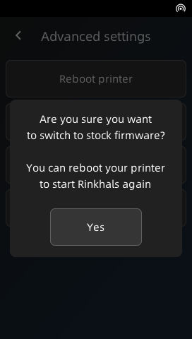
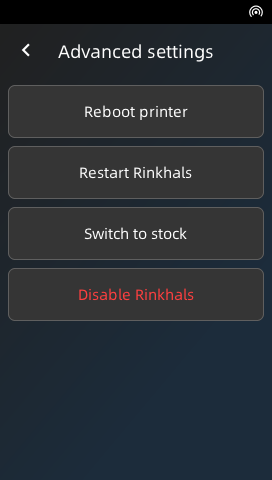

Rinkhals includes a touch UI you can access from the Settings (gear icon) > Rinkhals.

During startup, Rinkhals replaces the Support option in the menu by the Rinkhals option (so you don't contact Anycubic support for something about Rinkhals).

    
    
    

## App management

{ width="160", align=right }
{ width="160", align=right }

From this view you can access the list of installed apps. By tapping the checkbox you can quickly enable & start or disable & stop apps.

By tapping the app name you will enter the app details view where you can individually Enable/Disable, Start/Stop, access the settings if the app exposes some, and access a QR code if the app requires some actions from the user (to login for example).

## Updates

!!! note

    This part will soon be replaced by the Installer update experience

## Advanced

{ width="160", align=right }
{ width="160", align=right }

- **Reboot printer**: Reboot the printer (`sync && reboot`)
- **Restart Rinkhals**: Soft reboot for Rinkhals. Will restart the currently running version of Rinkhals.
- **Switch to stock**: Stops Rinkhals, making the printer switch to stock firmware. On the next reboot, the printer will reboot back to Rinkhals.
- **Disable Rinkhals**: Disables Rinkhals and reboot to stock firmware. Rinkhals is now disabled and will need to be reinstalled and re-enabled to start again.
  

