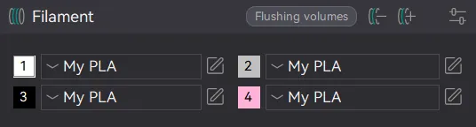

## My printer is stuck with error 11407
GoKlipper (1) is not starting properly, it's most likely due to a printer configuration issue.
{ .annotate }

1. GoKlipper is Anycubic's reimplementation of Klipper in Go

Please check the information in [I got 11407 or my printer doesn't boot anymore](Rinkhals/printer-configuration.md#i-got-11407-or-my-printer-doesnt-boot-anymore)

## Should I use installer-\*.swu or update-\*.swu?

The installer-\*.swu is the Rinkhals Installer tool. It's like a web installer on steroids. Using this tool you can download any Rinkhals or system firmware and perform some other operations. Check more details on the [Installer page](Rinkhals/rinkhals-installer.md)

The update-\*.swu is the full Rinkhals package. There's no installation screen here, it will just install the downloaded Rinkhals version on your printer. Useful for offline installations for example.

Either way, select the right SWU for your printer, download it and install it as described in the [installation page](Rinkhals/installation-and-firmware-updates.md).

## How can I print multicolor / with the ACE from Orca Slicer?
Filament mapping is stored in the gcode and depends on your slicer configuration.

In Orca, you can add 4 filaments and they will be mapped with the 4 slots of the ACE Pro from left to right. You can then either export gcode or print directly.

Later, if you need to print with only one filament, you’ll need to remove the other and keep only one before exporting gcode or printing.

## After installing Rinkhals, the camera doesn't work in Anycubic apps

The camera cannot work both in OctoApp / Mainsail / Fluidd and Anycubic apps at the same time.
Rinkhals uses mjpg-streamer by default (available as an app).

When the app is started and enabled, the camera will be available in OctoApp, Mainsail, Fluidd and other Moonraker clients.

You have to disable and stop the app to make the camera work in Anycubic apps.

## Can I use OctoApp with Rinkhals?
Yes, Rinkhals supports OctoApp out of the box. To work properly, OctoApp needs the Moonraker app and one of Mainsail and Fluidd app to be enabled.

You don’t need the octoapp companion from this repo: [Rinkhals.apps](https://github.com/jbatonnet/Rinkhals.apps/) for OctoApp to work. This companion app will allow you to get live notifications if this is something you want.

## I cannot see my camera in OctoApp / Mainsail / Fluidd

First, make sure the mjpg-streamer app is enabled as described above. Then you will need to add your camera in Mainsail or Fluidd for it to be available in other apps. Default settings will work.

## How do I make Spoolman work?
Follow this guide: [https://github.com/utkabobr/DuckPro-Kobra3/issues/54#issuecomment-2540040852](https://github.com/utkabobr/DuckPro-Kobra3/issues/54#issuecomment-2540040852)

The code modifications are already in Rinkhals.

## How to get SSH access?
If Rinkhals is running on your printer, you can already connect to port 22 on your printer.

If you’re running stock firmware or any other, you’ll need to use the SSH SWU tool. This tool will start a SSH server on port 2222 on any firmware at any time.
1. Go to the releases page: [https://github.com/jbatonnet/Rinkhals/releases](https://github.com/jbatonnet/Rinkhals/releases)
2. Download the right SWU tools for your printer (tools-xxx.zip)
3. Extract and get the SSH tool you want
4. Copy the tool as `update.swu` on a FAT32 USB drive in a `aGVscF9zb3Nf` directory (same as during Rinkhals installation)
5. Use any SSH client to connect to your printer IP on port 2222

## How does Rinkhals work with official updates (stock OTA)?
When you install an official update, Rinkhals startup files will be overwritten and thus Rinkhals won't boot anymore.

In this case, you can reflash a Rinkhals version that supports your firmware version and it will start again. Your configuration will be kept.

If you update your printer firmware to a version that's not supported with Rinkhals, you can either:

- Wait for the new Rinkhals version to be released. Please do not open issues or ask for ETA, I'm working on my free time!
- Reinstall a supported version of your printer firmware and install a matching Rinkhals version
- Starting from 20250316_01, you can create a .enable-rinkhals file at the root of a USB drive, plug it and reboot your printer. It will force Rinkhals to start, but you might experience weird behavior or even worse as the version was not tested.
