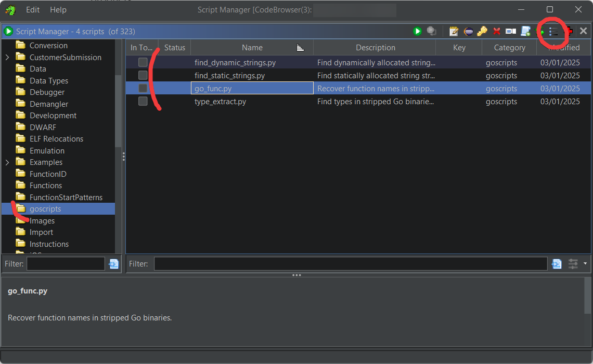

I use [Ghidra](https://github.com/NationalSecurityAgency/ghidra) and [Binary Ninja](https://github.com/NationalSecurityAgency/ghidra) to work on binary decompilation / patching.

I find Binary Ninja is good to quickly load binaries and browse them when you already know what you want or the file structure.

Ghidra has more tools to explore and understand how things work. It also has a scripts system to automate some tasks, like for Go decompilation as described below.

## General

In Anycubic Kobra firmwares, there are a few main binaries:

- **K3SysUi** responsible for the screen UI, written in C/C++
- **gklib** the reimplementation of Klipper (aka. GoKlipper), written in Go
- **gkapi** the API / MQTT / internal orchestrator, written in Go
- **gkcam** reponsible for the attached USB camera and cloud streaming, written in C++

## Go decompilation

!!! note

    [https://cujo.com/blog/reverse-engineering-go-binaries-with-ghidra/](https://cujo.com/blog/reverse-engineering-go-binaries-with-ghidra/) explains quite well why Go decompilation is complex

While C++ decompiles quite well, Go is quite bad as you will get unnamed functions and many strings that are concatenated together, without references.

I took the scripts from the link above and adapted them for newer versions of Go used for Anycubic products.

??? info "Here are the scripts"

    :octicons-download-16: [find_dynamic_strings.py](../assets/attachments/binary-decompilation-and-patching/find_dynamic_strings.py)

    :octicons-download-16: [find_static_strings.py](../assets/attachments/binary-decompilation-and-patching/find_static_strings.py)

    :octicons-download-16: [go_func.py](../assets/attachments/binary-decompilation-and-patching/go_func.py)

    :octicons-download-16: [type_extract.py](../assets/attachments/binary-decompilation-and-patching/type_extract.py)

Once downloaded, place the scripts in Ghidra directory, then:

- Window > Script Manager
- Click the icon on the top right to specify the script location
- You’ll see the scripts in a “goscripts” directory in the list
- You can now double click on a script to run it

Then after Ghidra analysis is complete, I usually run `go_func.py` then `find_dynamic_strings.py` and `find_static_strings.py`.

## Binary patching in Rinkhals

Rinkhals injects a menu entry in the UI process in order to provide a touch UI experience to manage apps, updates and more. I chose to replace the “Support” menu item to avoid people having issues with Rinkhals calling Anycubic support.

To do that, patch scripts are provided in every Rinkhals release for supported firmware versions.

This is the patch generation process (in `/3-rinkhals/opt/rinkhals/patches/create-patches.py`)
- Using `pwntools` this script will dynamically patch a binary to generate a new patched one
- Then it will compare the original binary with the patch and generate a diff
- The diff is then formatted as a patch script that checks for the right input and then apply the patch