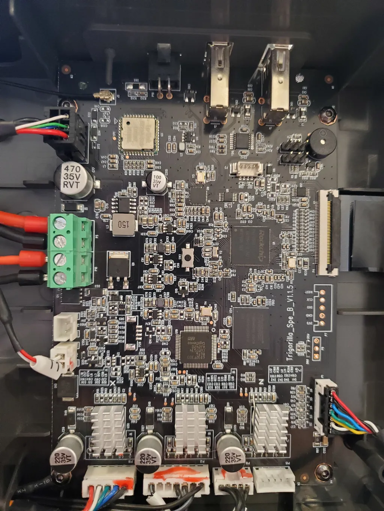
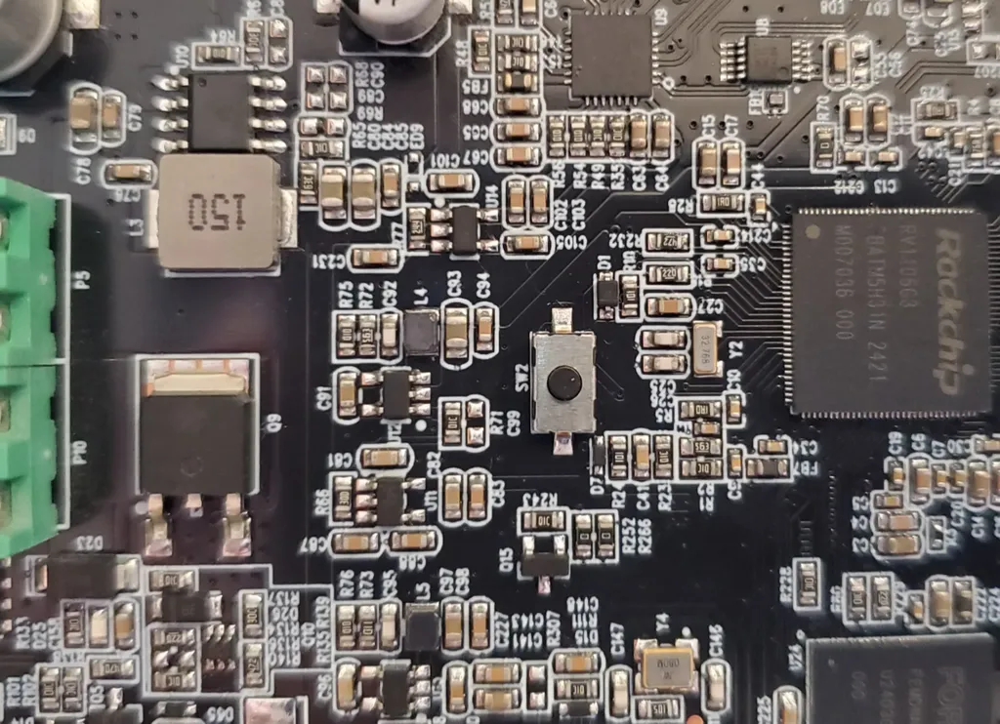
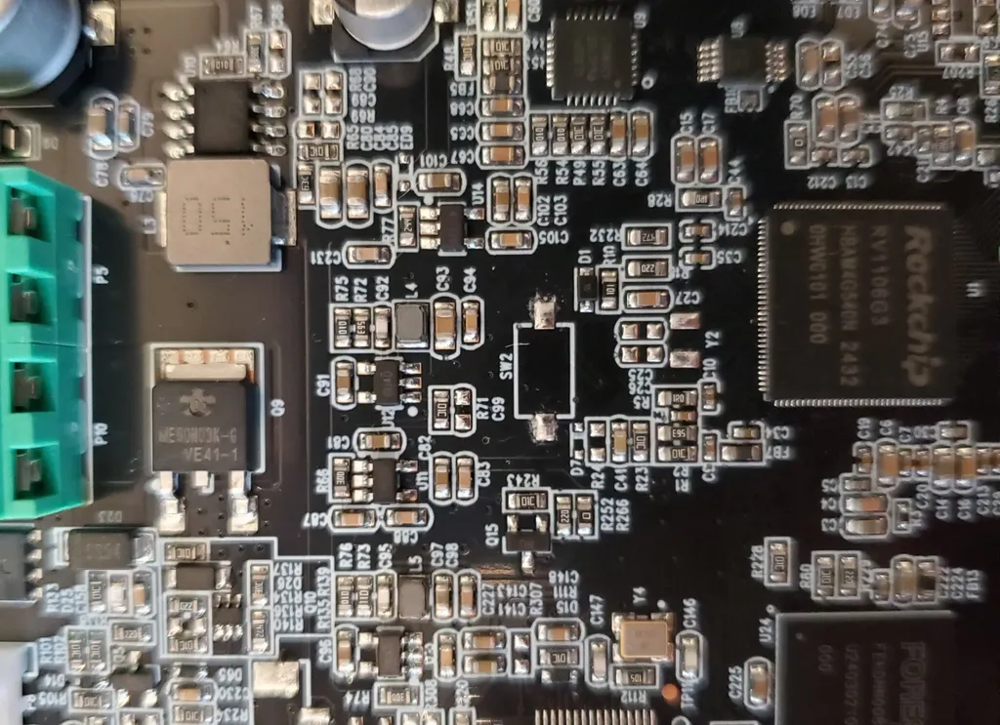

## General

- SWU password: `U2FsdGVkX19deTfqpXHZnB5GeyQ/dtlbHjkUnwgCi+w=`
- Ex/Im password: `2YLVrATRvUEnMeXk6Vtc7qxfzYM4TJzrLnEBma8zpUKeGtseGWqp4LXs7e8KeU2u`
- SSH root password: `rockchip`

## Components

??? info "Mainboard"

    

    - 

    Mainboard for the Kobra 3 (early unit)
    - 

    Cropped image of SW2 and surrounding components (early unit)
    - 

    Cropped image of SW2 and surrounding components (late unit with missing SW2)

    

## Firmware history

Check https://github.com/jbatonnet/Rinkhals.Firmwares/blob/main/manifests-anycubic/manifest-k3.json
