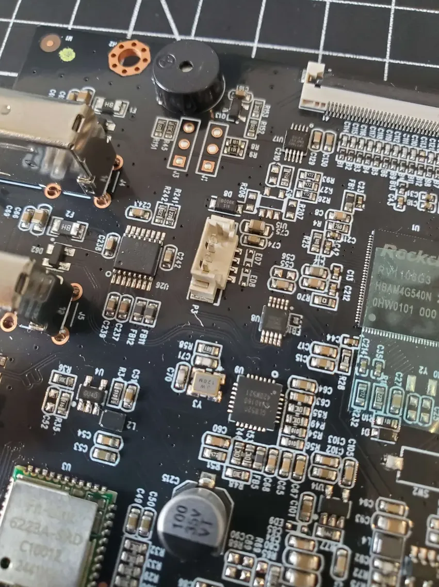
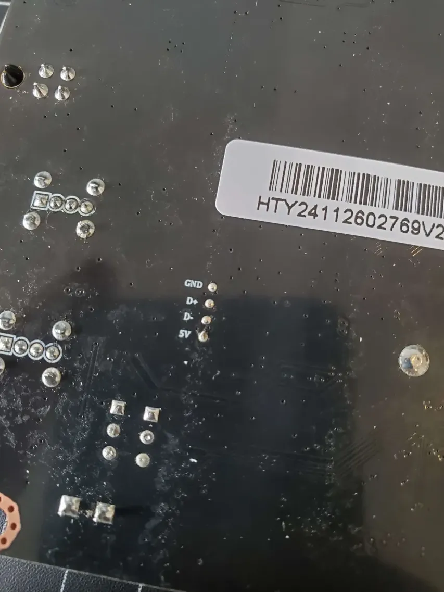
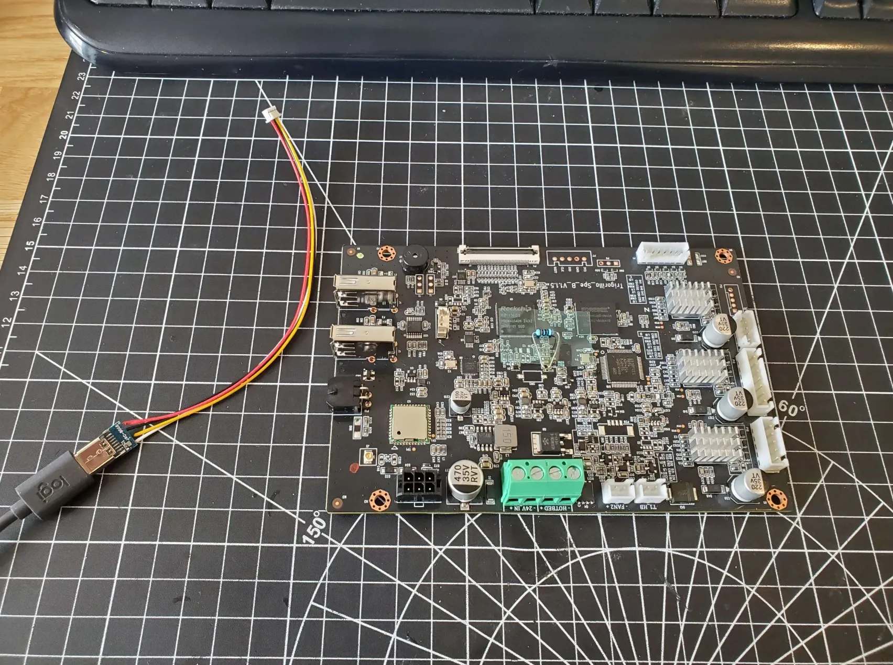
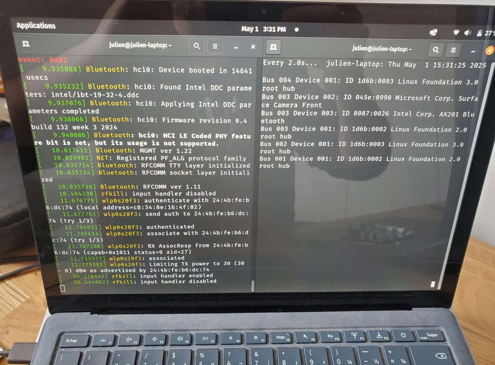
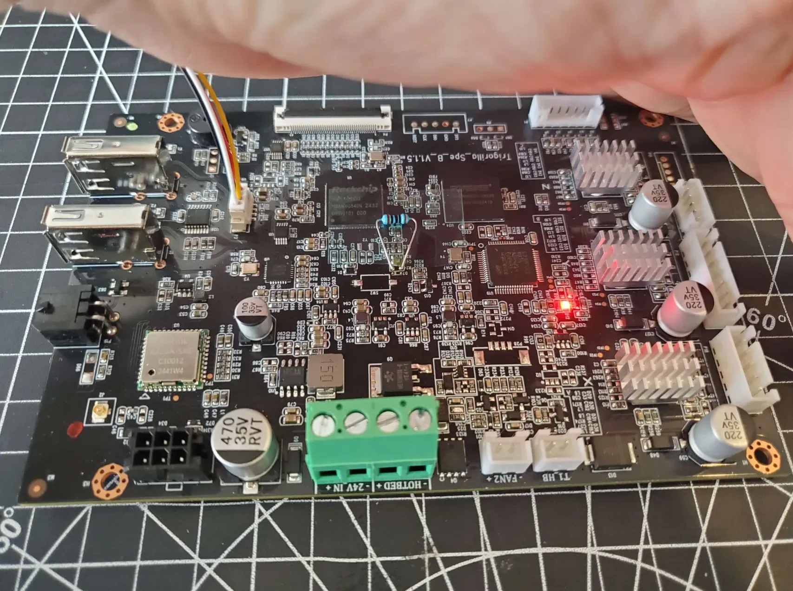
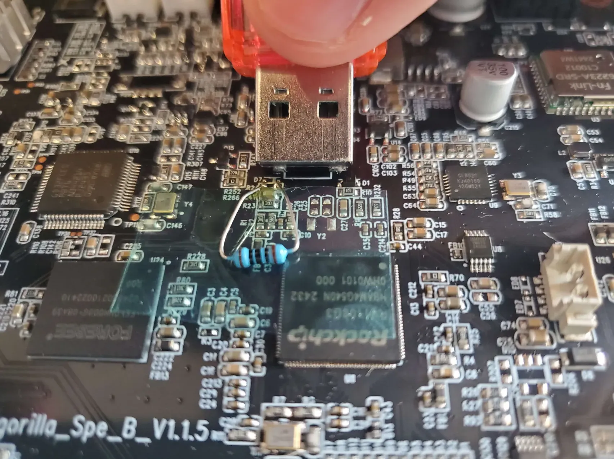
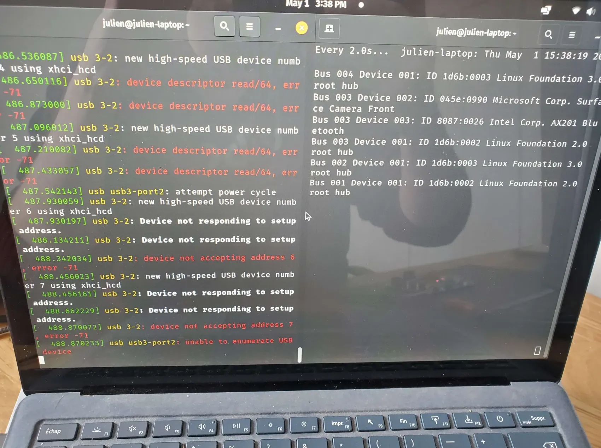

So down is GND, up is 5V in the picture

The opposite of yours, but maybe that's it for the K3M

Do you have labels on the back?

Anyway I guess there are some diodes to block reverse current..

This is my setup, the USB-C cable is already plugged to my laptop

`dmesg -w` on the left and `lsusb` on the right 

If I just plug the board without SW2, the LED goes red and after a few seconds I hear 2 beeps (cause it boots)

Nothing on the laptop

Okay, then I use a USB drive (why not..) to short SW2

While I plug the USB JST connector

This time it did not work, so I guess I plugged the USB-C in reverse

Ok that was it, USB in reverse, so I reversed the USB-C connector

Now the laptop displays errors in dmesg

As soon as the cable was connected, maybe 1s after connection

Okay finally got it, after a couple of retries / reversing cable / changing cable

You see 3 lines on the left with New USB found

And the Fuzhou Rockchip on the right