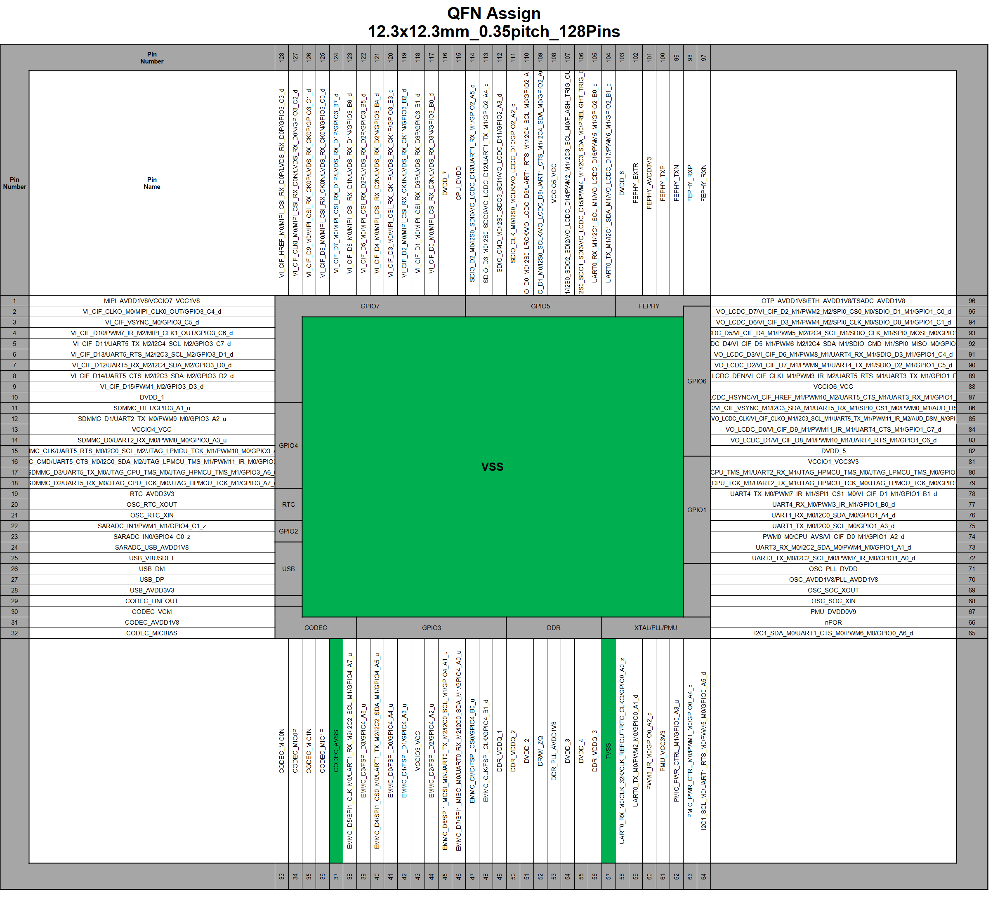
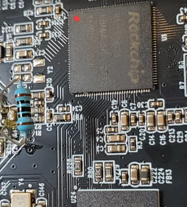

**On the K3:**

- The JST is connected to a SGM7227 (High Speed USB 2.0 Analog Switch) and then to a GL852G (Genesys Logic USB 2.0 Hub Controller)
- I don't "see" those chips on the K3M board though from the pictures I have

**On the K3M:**

- SGM7227 and GL852G are missing
- Connecting the USB shows a Genesys Logic USB2.0 Hub device (05e3:610)
    - USB connection works, but it just exposes the internal USB hub with access to the camera and the other ports
    - Download mode through USB doesn’t seem to be accessible from there

Test on K3M:

`05e3:610 > Genesys Logic USB2.0 Hub`

**RV1106 doc**

:octicons-download-16: [postal_emmc_ft232h.zip](../../assets/attachments/postal_emmc_ft232h.zip)

:octicons-download-16: [ft232h_postal_guide.pdf](../../assets/attachments/ft232h_postal_guide.pdf)
